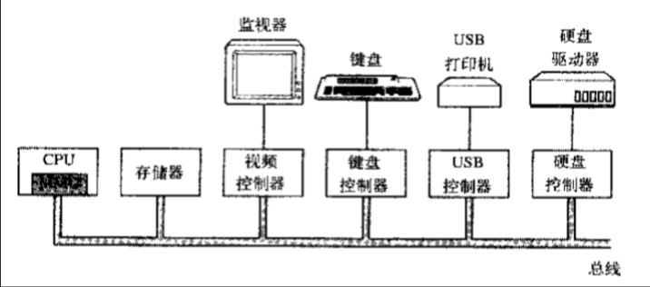
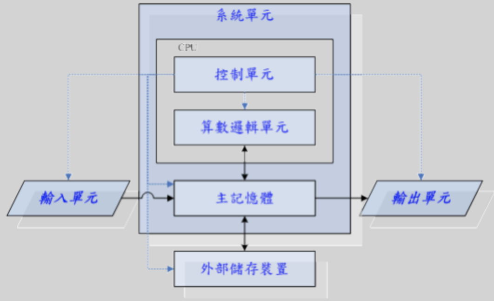
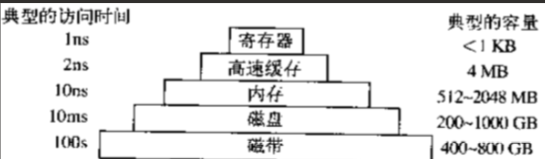

# 计算机硬件知识

计算机硬件有 5 大部分：

- 控制器：是计算机的指挥系统，负责控制计算机其他硬件的运行，相当于人的大脑

- 运算器：包括数学运算和逻辑运算，相当于人的大脑

控制器 + 运算器 = CPU（中央处理器）

- 存储器：存储数据
  - 内存（主存）：如内存条（又称随机存储器），存取速度快，但是基于电工作，一旦断电数据就丢失，只能临时存储。称为主存的原因是所有的数据指令存取都必须经过内存传输。类似于人的记忆功能，容易断片
  - 外存：如硬盘，存取速度相对内存很慢，数据可以近似 “永久” 保存。类似于使用的笔记本子。外存也当作输入/输出设备

- 输入设备：计算机接收外界输入数据的工具，一般如键盘、鼠标等

- 输出设备：计算机向外输出数据的工具，如显示屏、打印机等

CPU、内存 (主存储器) 以及其他 I/O 设备（输入/输出设备）都由一条系统总线连接起来并通过总线与其他设备通信：

因此，可以说 CPU + 主存储器 + 输入/输出 构成了电子计算机的三大核心组件：

## 处理器 CPU

通常将运算器和控制器合称为中央处理器(Central Processing Unit，CPU)。其中运算器用来主要负责程序运算与逻辑判断，控制器则主要协调各组件和各单元的工作，所以CPU的工作主要在于管理和运算。可以说计算机的大脑就是CPU，它从内存中取指令->解码->执行，然后再取指->解码->执行下一条指令，周而复始，直至整个程序被执行完成。 

既然CPU的重点在于进行运算和判断，那么要被运算与判断的数据是从哪里来的？CPU读取的数据都是从主存储器（内存）来的！主存储器内的数据则是从输入单元所传输进来！而CPU处理完毕的数据也必须先写回主存储器中，最后数据才从主存储器传输到输出单元。

在超大规模集成电路构成的微型计算机中，往往将CPU制成一块具有特定功能的芯片，称为微处理器，芯片里边有编写好的微指令集,我们在主机上的所有操作或者说任何软件的执行最终都要转化成cpu的指令去执行,如输入输出，阅读，视频，上网等这些都要参考CPU是否内置有相关微指令集才行。如果没有那么CPU无法处理这些操作。不同的CPU指令集不同对应的功能也不同，这就好比不同的人脑，对于大多数人类来说，人脑的结构一样，但是大家的智商都有差别。

### 精简指令集和复杂指令集

精简指令集（Reduced Instruction Set Computing，RISC）：这种CPU的设计中，微指令集较为精简，每个指令的运行时间都很短，完成的动作也很单纯，指令的执行效能较佳；但是若要做复杂的事情，就要由多个指令来完成。常见的RISC指令集CPU主要例如Sun公司的SPARC系列、IBM公司的Power Architecture（包括PowerPC）系列、与ARM系列等。

SPARC架构的计算机常用于学术领域的大型工作站中，包括银行金融体系的主服务器也都有这类的计算机架构；

PowerPC架构的应用，如Sony出产的Play Station 3（PS3）使用的就是该架构的Cell处理器。

ARM是世界上使用范围最广的CPU了，常用的各厂商的手机、PDA、导航系统、网络设备等，几乎都用该架构的CPU。

复杂指令集（Complex Instruction Set Computer，CISC）与RISC不同，在CISC的微指令集中，每个小指令可以执行一些较低阶的硬件操作，指令数目多而且复杂，每条指令的长度并不相同。因此指令执行较为复杂所以每条指令花费的时间较长，但每条个别指令可以处理的工作较为丰富。常见的CISC微指令集CPU主要有AMD、Intel、VIA等的x86架构的CPU。
    
CPU按照指令集可以分为精简指令集CPU和复杂指令集CPU两种，区别在于前者的指令集精简，每个指令的运行时间都很短，完成的动作也很单纯，指令的执行效能较佳；但是若要做复杂的事情，就要由多个指令来完成。后者的指令集每个小指令可以执行一些较低阶的硬件操作，指令数目多而且复杂，每条指令的长度并不相同。因为指令执行较为复杂所以每条指令花费的时间较长，但每条个别指令可以处理的工作较为丰富。

### x86 架构和 64 位

x86 是针对cpu的型号或者说架构的一种统称，详细地讲，最早的那颗Intel发明出来的CPU代号称为8086，后来在8086的基础上又开发出了80285、80386....，因此这种架构的CPU就被统称为x86架构了。
        
由于AMD、Intel、VIA所开发出来的x86架构CPU被大量使用于个人计算机上面，因此，个人计算机常被称为x86架构的计算机！

程序员开发出的软件最终都要翻译成cpu的指令集才能运行，因此软件的版本必须与cpu的架构契合，举个例子，我们在MySQL官网下载软件MySQL时名字为：

      Windows(x86,32-bit),ZIP Archive
      (mysql-5.7.20-win32.zip)   

我们发现名字中有x86，这其实就是告诉我们：该软件应该运行在x86架构的计算机上。

64位，cpu的位数指的是cpu一次性能从内存中取出多少位二进制指令，64bit指的是一次性能从内存中取出64位二进制指令。
    
在2003年以前由Intel所开发的x86架构CPU由8位升级到16、32位，后来AMD依此架构修改新一代的CPU为64位，到现在，个人计算机CPU通常都是x86_64的架构。

cpu具有向下兼容性，指的是64位的cpu既可以运行64位的软件，也可以运行32位的软件，而32位的cpu只能运行32位的软件。

### 寄存器

因访问内存以得到指令或数据的时间比cpu执行指令花费的时间要长得多，所以，所有CPU内部都有一些用来保存关键变量和临时数据的寄存器，这样通常在cpu的指令集中专门提供一些指令，用来将一个字（可以理解为数据）从内存调入寄存器，以及将一个字从寄存器存入内存。cpu其他的指令集可以把来自寄存器、内存的操作数据组合，或者用两者产生一个结果，比如将两个字相加并把结果存在寄存器或内存中。

寄存器的分类：

除了用来保存变量和临时结果的通用寄存器外，多数计算机还有一些对程序员课件的专门寄存器，其中之一便是程序计数器，它保存了将要取出的下一条指令的内存地址。在指令取出后，程序计算器就被更新以便执行后期的指令。

另外一个寄存器便是堆栈指针，它指向内存中当前栈的顶端。该栈包含已经进入但是还没有退出的每个过程中的一个框架。在一个过程的堆栈框架中保存了有关的输入参数、局部变量以及那些没有保存在寄存器中的临时变量。

最后 一个非常重要的寄存器就是程序状态字寄存器(Program Status Word,PSW),这个寄存器包含了条码位(由比较指令设置)、CPU优先级、模式（用户态或内核态），以及各种其他控制位。用户通常读入整个PSW，但是只对其中少量的字段写入。

寄存器的维护：

操作系统必须知晓所有的寄存器。在时间多路复用的CPU中，操作系统会经常中止正在运行的某个程序并启动（或再次启动）另一个程序。每次停止一个运行着的程序时，操作系统必须保存所有的寄存器，这样在稍后该程序被再次运行时，可以把这些寄存器重新装入。

### 处理器设计的演变

最开始取值、解码、执行这三个过程是同时进行的，这意味着任何一个过程完成都需要等待其余两个过程执行完毕，时间浪费

后来被设计成了流水线式的设计，即执行指令n时，可以对指令n+1解码，并且可以读取指令n+2,完全是一套流水线。

超变量cpu，比流水线更加先进，有多个执行单元，可以同时负责不同的事情，比如看片的同时，听歌，打游戏。

两个或更多的指令被同时取出、解码并装入一个保持缓冲区中，直至它们都执行完毕。只有有一个执行单元空闲，就检查保持缓冲区是否还有可处理的指令。

这种设计存在一种缺陷，即程序的指令经常不按照顺序执行，在多数情况下，硬件负责保证这种运算结果与顺序执行的指令时的结果相同。

### 内核态与用户态

除了在嵌入式系统中的非常简答的CPU之外，多数CPU都有两种模式，即内核态与用户态。

通常，PSW中有一个二进制位控制这两种模式。

内核态：当cpu在内核态运行时，cpu可以执行指令集中所有的指令，很明显，所有的指令中包含了使用硬件的所有功能，（操作系统在内核态下运行，从而可以访问整个硬件）

用户态：用户程序在用户态下运行，仅仅只能执行cpu整个指令集的一个子集，该子集中不包含操作硬件功能的部分，因此，一般情况下，在用户态中有关I/O和内存保护（操作系统占用的内存是受保护的，不能被别的程序占用），当然，在用户态下，将PSW中的模式设置成内核态也是禁止的。

内核态与用户态切换：

用户态下工作的软件不能操作硬件，但是我们的软件比如暴风影音，一定会有操作硬件的需求，比如从磁盘上读一个电影文件，那就必须经历从用户态切换到内核态的过程，为此，用户程序必须使用系统调用（system call），系统调用陷入内核并调用操作系统，TRAP指令把用户态切换成内核态，并启用操作系统从而获得服务。

请把的系统调用看成一个特别的的过程调用指令就可以了，该指令具有从用户态切换到内核态的特别能力。

### 多线程和多核芯片

moore 定律指出，芯片中的晶体管数量每18个月翻一倍，随着晶体管数量的增多，更强大的功能称为了可能，如

第一步增强：在cpu芯片中加入更大的缓存，一级缓存L1，用和cpu相同的材质制成，cpu访问它没有时延

第二步增强：一个cpu中的处理逻辑增多，intel公司首次提出，称为多线程（multithreading）或超线程（hyperthreading），对用户来说一个有两个线程的cpu就相当于两个cpu，我们后面要学习的进程和线程的知识就起源于这里，进程是资源单位而线程才是cpu的执行单位。

多线程运行cpu保持两个不同的线程状态，可以在纳秒级的时间内来回切换，速度快到你看到的结果是并发的，伪并行的，然而多线程不提供真正的并行处理，一个cpu同一时刻只能处理一个进程（一个进程中至少一个线程）。

第三步增强：除了多线程，还出现了傲寒2个或者4个完整处理器的cpu芯片。要使用这类多核芯片肯定需要有多处理操作系统。

## 存储器

存储器按存储速度可以划分为寄存器、高速缓存、内存、磁盘、磁带（已过时）等：

存储器系统采用如上图的分层结构，顶层的存储器速度较高，容量较小，与底层的存储器相比每位的成本较高，其差别往往是十亿数量级的。

### 寄存器：

即 L1 缓存，用与cpu相同材质制造，与cpu一样快，因而cpu访问它无时延，典型容量是：在32位cpu中为 `32*32`，在64位cpu中为 `64*64`，在两种情况下容量均<1KB。

### 高速缓存：

即 L2 缓存，主要由硬件控制高速缓存的存取，内存中有高速缓存行按照0~64字节为行0，64~127为行1。。。最常用的高速缓存行放置在cpu内部或者非常接近cpu的高速缓存中。当某个程序需要读一个存储字时，高速缓存硬件检查所需要的高速缓存行是否在高速缓存中。如果是，则称为高速缓存命中，缓存满足了请求，就不需要通过总线把访问请求送往主存(内存)，这毕竟是慢的。高速缓存的命中通常需要两个时钟周期。高速缓存为命中，就必须访问内存，这需要付出大量的时间代价。由于高速缓存价格昂贵，所以其大小有限，有些机器具有两级甚至三级高速缓存，每一级高速缓存比前一级慢但是容易大。

缓存在计算机科学的许多领域中起着重要的作用，并不仅仅只是RAM（随机存取存储器）的缓存行。只要存在大量的资源可以划分为小的部分，那么这些资源中的某些部分肯定会比其他部分更频发地得到使用，此时用缓存可以带来性能上的提升。一个典型的例子就是操作系统一直在使用缓存，比如，多数操作系统在内存中保留频繁使用的文件（的一部分），以避免从磁盘中重复地调用这些文件，类似的 /root/a/b/c/d/e/f/a.txt 的长路径名转换成该文件所在的磁盘地址的结果然后放入缓存，可以避免重复寻找地址，还有一个web页面的url地址转换为网络地址(IP)地址后，这个转换结果也可以缓存起来供将来使用。

缓存是一个好方法，在现代cpu中设计了两个缓存，再看4.1中的两种cpu设计图。第一级缓存称为L1总是在CPU中，通常用来将已经解码的指令调入cpu的执行引擎，对那些频繁使用的数据自，多少芯片还会按照第二L1缓存 。。。另外往往设计有二级缓存L2，用来存放近来经常使用的内存字。L1与L2的差别在于对cpu对L1的访问无时间延迟，而对L2的访问则有1-2个时钟周期（即1-2ns）的延迟。

### 内存：

再往下一层是主存，此乃存储器系统的主力，主存通常称为随机访问存储RAM，就是我们通常所说的内存，容量一直在不断攀升，所有不能再高速缓存中找到的，都会到主存中找，主存是易失性存储，断电后数据全部消失。

除了主存RAM之外，许多计算机已经在使用少量的非易失性随机访问存储如ROM（Read Only Memory，ROM），在电源切断之后，非易失性存储的内容并不会丢失，ROM只读存储器在工厂中就被编程完毕，然后再也不能修改。ROM速度快且便宜，在有些计算机中，用于启动计算机的引导加载模块就存放在ROM中，另外一些I/O卡也采用ROM处理底层设备的控制。

EEPROM（Electrically Erasable PROM，电可擦除可编程ROM）和闪存（flash memory）也是非易失性的，但是与ROM相反，他们可以擦除和重写。不过重写时花费的时间比写入RAM要多。在便携式电子设备中中，闪存通常作为存储媒介。闪存是数码相机中的胶卷，是便携式音译播放器的磁盘，还应用于固态硬盘。闪存在速度上介于RAM和磁盘之间，但与磁盘不同的是，闪存擦除的次数过多，就被磨损了。

还有一类存储器就是CMOS，它是易失性的，许多计算机利用CMOS存储器来保持当前时间和日期。CMOS存储器和递增时间的电路由一小块电池驱动，所以，即使计算机没有加电，时间也仍然可以正确地更新，除此之外CMOS还可以保存配置的参数，比如，哪一个是启动磁盘等，之所以采用CMOS是因为它耗电非常少，一块工厂原装电池往往能使用若干年，但是当电池失效时，相关的配置和时间等都将丢失。

在linux系统中操作系统内核会利用物理内存分配两个特殊的区域：目的是减少系统调用次数，降低 CPU 上下文切换和磁盘访问频率：

1，buffer：缓冲区，用于积攒需要写入硬盘的数据，到一定量会在一次性写入硬盘，提高性能（当遇到突然断电时，要利用备用电源的时间尽快将buffer区的数据写入硬盘，防止数据丢失）。

2，cache：缓存区，用于将硬盘中常用的一些数据提前存到缓存中，CPU取数据可以直接从缓存中读取。

虚拟内存：许多计算机支持虚拟内存机制，该机制使计算机可以运行大于物理内存的程序，方法是将正在使用的程序放入内存取执行，而暂时不需要执行的程序放到磁盘的某块地方，这块地方成为虚拟内存，在linux中成为swap，这种机制的核心在于快速地映射内存地址，由cpu中的一个部件负责，成为存储器管理单元(Memory Management Unit MMU)。
 
从一个程序切换到另外一个程序，成为上下文切换(context switch),缓存和MMU的出现提升了系统的性能，尤其是上下文切换。

### 硬盘

- 机械硬盘（HDD）

依靠机械物理移动，所以使用不当易造成磁盘表面损坏。

扇区：硬盘的最小读写单位是一个扇区，1个扇区相当于512字节Bytes（0.5K）。

block块：操作系统读写的最小单位是一个block块，1个block块相当于8个扇区即4K。

分区：从一个柱面到另一个柱面之间的所有磁盘区域可为一个分区（大小可自定义）。

IO 延迟 = 平均寻道时间 + 平均延迟时间（约9ms）

平均寻道时间取决于目前的物理水平，大概5ms，平均延迟时间取决于磁盘的转速，一般常见磁盘转速为7200r/min即转一圈大约需要8ms，所以平均延迟时间大概4ms左右（转半圈）。

- 固态硬盘（SSD）

基于闪存原理（固态电子存取数据）工作，读写速度比机械硬盘快几十倍上百倍，也不怕使用时计算机被移动，但成本高

所以硬盘的性能：固态硬盘 > 机械硬盘

- 容量单位

1B（bytes）=8 bit（比特位）、1KB=1024B、1MB=1024KB、1GB=1024MB、1TB=1024GB、1PB=1024TB、1EB=1024PB

- 硬盘接口种类
  - IDE（并口）：采用并行接口，所以传输速率变高时，传输的数据和信号容易会产生干扰错误（逐渐过时淘汰）
  - SATA（串口）：采用串行接口，具有较强的纠错能力从而提高了传输可靠性，结构简单，支持热插拔，是目前个人PC硬盘的主力接口
  - SCSI：主要用于小型机服务器（由于小型机的淘汰所以基本不用此接口）
  - SAS：将SATA和SCSI两者的优势结合起来的新一代接口，SAS在物理层和协议层向下兼容SATA
  - 光纤通道：起初是为网络系统设计，后应用于硬盘，主要用于高端服务器场景，价格昂贵

常见硬盘接口层面性能：SAS>SATA（存储速率）

所以一般常见配置性能由高到低有四种：

1，SSD硬盘+SAS接口：价格昂贵（对运维人员最友好）

2，SSD硬盘+SATA接口：企业常规，对速度有一定要求

3，HDD硬盘+SAS接口：企业常规，仅有核心业务有速度要求

4，HDD硬盘+SATA接口：企业内部服务或个人PC，访问量较小，对速度没要求

冷热数据：用户经常访问的数据为热数据，不常访问的数据为冷数据

在高并发情况下追求性价比，可以通过算法区分出冷热数据，将热数据放在SSD盘，冷数据放在HDD盘上；对外业务上主选SAS硬盘，尤其是核心业务，对速度要求比较高，而对内部的服务，备份等可以选用SATA硬盘，容量大，价格便宜，只是速度较慢。

- RAID磁盘阵列卡（对硬盘做集群）

将所有硬盘容量整合在一起；可以让数据更安全，防止单点故障；可以获得更高的性能

RAID是一种存储性能，数据安全和存储成本兼顾的解决方案，硬raid是指通过raid卡配置硬盘，软raid是指通过软件制作的raid功能配置硬盘

整合方式：其中常见四种

1，RAID0：数据条带存放，将连续的数据分散到n个磁盘上，至少一块盘

容量：n块盘合在一起的总容量

性能：理论上是n块盘合在一起的读写速度即n倍速度，但实际上速度要略低一些

冗余性：不能损坏任何一块盘，一旦损坏，整个盘就不能用了

使用场合：追求读写速度，对数据安全性没有要求（一般用于集群服务，实际很少使用）

特点：速度快，但是无冗余（备份），数据不安全

2，RAID1：镜像，将写入硬盘的数据百分百复制备份到另一个硬盘中，实现存储双份数据，只支持两块盘

容量：损失一半的容量（损失的容量用于数据备份）

性能：写入性能和单盘差不多，读取性能由于可以并发，所以速度为原来的两倍（raid0两块盘的读取速率）

冗余性：冗余度100%，数据最为安全

使用场合：对数据安全性有要求，但对读写速度没特殊要求，如系统盘

特点：100%冗余，容量损失一半

3，RAID5：折中方案，介于raid0和raid1之间，异或运算、奇偶校验，需要三块以上硬盘

容量：损失一块盘的容量（损失的一块盘用于记录奇偶校验结果）

性能：读写速率略低于raid0（多了奇偶校验信息），高于raid1

冗余性：可以损坏一块盘，其他两块盘可以通过奇偶校验重建损坏的盘的数据

使用场合：一般场合都可以使用，对读取速度和数据安全都有一定要求，但要求不高

特点：数据稍安全，磁盘利用率高，是RAID0和RAID1的折中方案

4，RAID10（1+0）：先镜像，再进行条带存放。兼顾了RAID0和RAID1的优点，但成本高

容量：损失一半容量

性能：较高的读写速度

冗余性：冗余度100%，数据安全

使用场合：可用于高性能，高安全但对容量要求不高的场合，如数据库服务器

特点：RAID0和RAID1的结合产物

## IO 设备等其他硬件

I/O设备一般包括两个部分：设备控制器和设备本身。

控制器：是查找主板上的一块芯片或一组芯片（硬盘，网卡，声卡等都需要插到一个口上，这个口连的便是控制器），控制器负责控制连接的设备，它从操作系统接收命令，比如读硬盘数据，然后就对硬盘设备发起读请求来读出内容。

控制器的功能：通常情况下对设备的控制是非常复杂和具体的，控制器的任务就是为操作系统屏蔽这些复杂而具体的工作，提供给操作系统一个简单而清晰的接口。

设备本身：有相对简单的接口且标准的，这样大家都可以为其编写驱动程序了。要想调用设备，必须根据该接口编写复杂而具体的程序，于是有了控制器提供设备驱动接口给操作系统。必须把设备驱动程序安装到操作系统中。

总线：随着处理器和存储器速度越来越快，单总线很难处理总线的交通流量，所以有了多总线模式，其中北桥为PCI桥（连接高速设备，如CPU、内存、寄存器），南桥为ISA桥（连接慢速设备，如I/O设备）。

UPS电源：不间断电源，一种可以蓄电的电源，提高电源稳定性（服务器的一般可以撑几个小时）。

IDRAC接口：戴尔服务器上的远程控制卡，用于异地远程即时查看服务器的硬件状态并可控制服务器开关机或重装系统。

## 程序运行，计算机启动流程

- 程序运行的大致流程：

1，首先将程序的代码指令存储于硬盘当中

2，需要运行时将代码指令从硬盘加载（写入）至内存中

3，然后CPU从内存中读取该程序的指令运行（所以计算机硬盘的大小决定了能安装的软件数目，内存的大小决定了计算机能同时运行的软件数目）

- 计算机的启动流程：

1，计算机加电

2，启动BIOS系统，扫描启动设备，寻找操作系统位置

3，读取启动设备的第一个扇区（主引导记录MBR共512字节），其中446字节为BootLoader（启动装载模块）即grub程序，64字节为分区信息，最后2字节为结束标志位

4，grub程序负责将操作系统内核载入内存，启动操作系统

5，操作系统让BIOS检测计算机硬件驱动程序是否完好，完好后将驱动程序调入操作系统内核，操作系统接管计算机

## 计算机优化

企业网站来讲，都会尽量让用户从内存中读取数据而不是硬盘，几乎所有的运维和架构师对网站，服务器，软件的优化核心，都是磁盘和内存的使用的比例优化。优化的基本原则：读入时，数据能从内存取就不到硬盘取；写入时，在内存中积攒一定量再统一写入硬盘。

具体优化方案可以从一下几个方面入手：

- 硬件：缓存、集群
- 操作系统：内核优化
- 应用程序
- 网络

对于大型企业（高并发）存数据采用先存内存再一次性存硬盘，取数据先内存再硬盘；而中小企业（低并发）存数据采用先存硬盘再存内存，取数据先内存再硬盘。